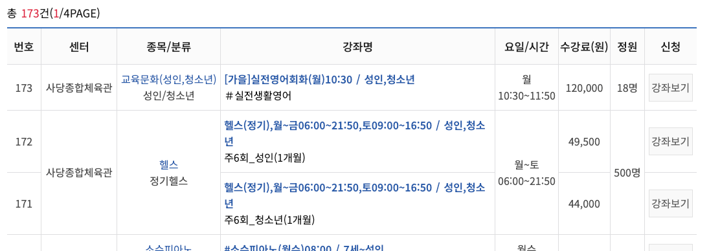
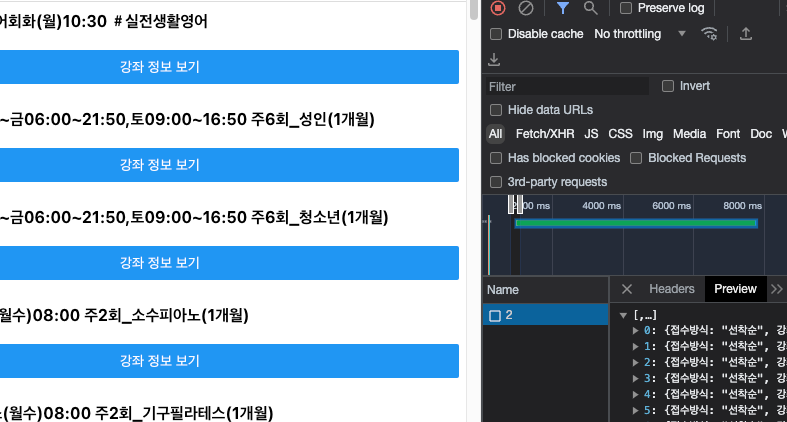

# 동작구청 체육센터 강의 보기

## URL: https://master.dykxha9wxyxyc.amplifyapp.com/
## 만든이유
[동작구청 체육센터](https://sports.idongjak.or.kr/home/171) 의 홈페이지에서 강의를 수강하려면, 수강신청을 해야 하는데, 

수강신청 사이트에서 남은 정원이 몇명이 있는지 확인하려면 강좌를 또 한번 클릭해야 한다.
그래서 잔여 정원도 한꺼번에 보기 위해 이 프로젝트를 만들었다.

## Stacks
### FE
- React-Native
- Deploy : GitHub + AWS Amplify
- [Expo Publish websites](https://docs.expo.dev/distribution/publishing-websites/#aws-amplify-console)

### BE
- AWS Lambda
- AWS API Gateway 
- Deploy : Serverless Framework

## Current
현재 무지성 크롤링으로 구현을 해서 API 속도가 매우 느린편이다.(약 6초)

## Plan
- [AWS EventBridge](https://ap-northeast-2.console.aws.amazon.com/scheduler/home?region=ap-northeast-2#schedules)
로 10분에 한번씩 크롤링한 결과를 DB에 저장하여 로딩되는 시간을 줄이기
- User가 원하는 강의의 잔여 정원이 생기면 알람을 주기 (Email, 핸드폰 알람 .. 등등)
- IOS, Android 배포

## 시작하기

### node 설치
node version: 20.xx

### expo 설치
expo: react native를 좀 간편하게 해주는 컴

### 프로젝트 시작

1. git clone https://github.com/jmhee28/dongjakguGym-FE-Dev.git
2. npm install
    - package.json : 이 프로젝트에 필요한 모듈들을 작성해논것
    - npm install: package.json에 적힌 모듈들 한번에 다운받게 해줌
    - node_modules가 생성이 됨

2. npm start 입력 후 w 
3. 파일 수정 후 빌드
   npx expo export:web

## File Descriptions
1. amplify-explicit.yml: Aws Amplify 설정 파일
2. App.js: 최상위 화면
3. API_list.js: API 목록
